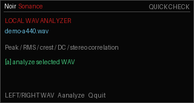
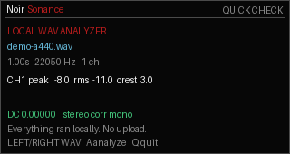

# NoirSonance Check

Local WAV analysis utility for Cardputer Zero.

NoirSonance Check is a lightweight local audio inspection tool for quick WAV checks on tiny devices and Linux desktops. It is built for offline use when you want a fast read on a file without opening a full studio session.

Features:

- Local WAV analysis workflow.
- Compact readout for handheld Cardputer Zero screens.
- Desktop mode for larger Linux displays.
- Offline-first operation with simple keyboard controls.

## Screenshots




## Install

Use the install helper:

```bash
curl -fsSL https://raw.githubusercontent.com/rimedag/noirsonance_check_cardputerzero/main/install.sh | sh
```

Or download the package for your machine:

```bash
ARCH="$(dpkg --print-architecture)"
curl -LO "https://raw.githubusercontent.com/rimedag/noirsonance_check_cardputerzero/main/pool/main/n/noirsonance-check/noirsonance-check_0.1.0-noirsonance2_${ARCH}.deb"
sudo apt install "./noirsonance-check_0.1.0-noirsonance2_${ARCH}.deb"
```

## Launch

Cardputer Zero / small display:

```bash
noirsonance-check-cardputerzero
```

Regular Linux desktop or Raspberry Pi HDMI desktop:

```bash
noirsonance-check-desktop
```

Automatic mode:

```bash
noirsonance-check
```

## Packages

Public downloads are architecture-specific binary builds:

- `amd64` for regular Linux desktops and laptops.
- `arm64` for Cardputer Zero and 64-bit Raspberry Pi OS.
